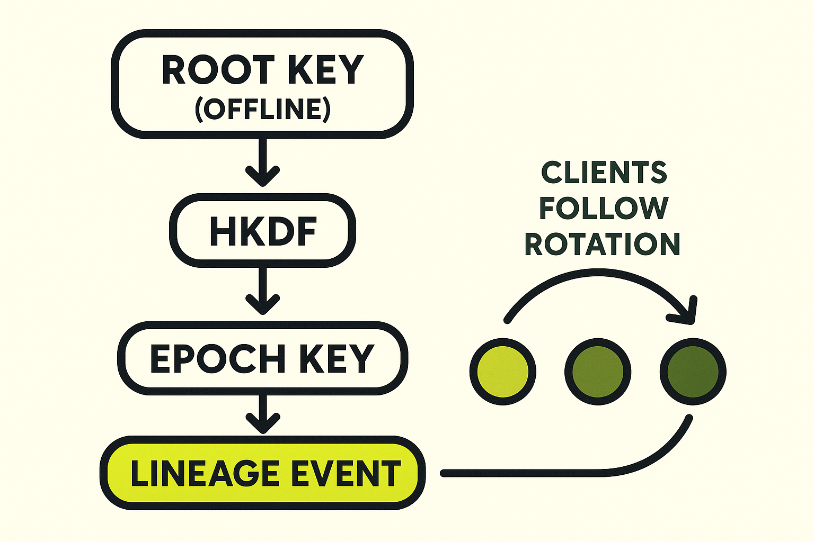

# **Cold Root Identity (CLI Prototype)**
[](https://github.com/GHOST-UntraceableDigitalDissident/cold-root-identity/actions/workflows/tests.yml)

*A reference implementation of offline root keys, deterministic epoch keys, and lineage proofs for Nostr.*


This project provides a **minimal, reproducible standard** for managing long lived Nostr identities using **cold root keys** and **rotating epoch keys**, without any protocol changes.
All derivation, signing, and lineage verification is done through a simple Python CLI.

This is not a client or a relay.
It is a **spec plus tooling layer** meant to give developers a safe identity lifecycle model.

> Status: Prototype v0.1.0 — seeking client developer feedback.  


---

# **Why This Exists**

Nostr users normally sign every event with a single long lived private key stored on a hot device.
If that key leaks, the identity is gone forever.

Cold Root Identity solves this by separating:

* **Cold root authority key (offline forever)**
* **Deterministic epoch operational keys (hot and rotating)**

The root key is used only to sign **lineage proofs** for new epoch keys.
The root never touches a daily device, and only epoch keys are imported into Nostr clients.

A compromise no longer destroys your identity.
It only compromises a finite epoch window.

---

# Identity flow at a glance
<sub>*Cold Root Identity: root authority stays offline, clients follow deterministic rotations.*</sub>




For detailed specification documents, see **[`/docs`](docs/)**.

---

# **Features**

### ✔ Generate a cold root key

`init` prints a 32 byte seed you store offline.

### ✔ Deterministically derive epoch keys

`derive-epoch` outputs the epoch keypair plus a signed lineage event.

### ✔ Verify lineage proofs

`verify-lineage` ensures the root→epoch signature and tags are valid.

### ✔ No protocol changes

Lineage events use standard **NIP 01**.
Relays remain unchanged.
Clients can support this today.

---

# Reference Vectors

Cold Root Identity ships with deterministic reference vectors to guarantee consistent behavior across implementations and languages. These vectors define:  
- The canonical root seed for test purposes
- The derived root secret and public keys
- The deterministic epoch key for 2025-Q1
- The corresponding lineage event signed by the root  

These vectors are frozen under:

`tests/vectors/cold_root_identity.v1.json`

Python re-derives these values in:

`tests/test_vectors.py`

Any implementation in Go, Rust, or another language must match this file byte-for-byte for:  
- Root secret key
- Root public key
- Epoch secret key
- Epoch public key

Lineage event fields:  
- kind
- created_at
- content
- tags
- pubkey

A signed tag marks the vector freeze:  

`v0.1.0-vectors`

If a future version of the specification changes derivation semantics, a new vector file and tag will be published.

## Deterministic Timestamp Rule

Runtime lineage events use the current system time.  
Reference vectors use a deterministic timestamp derived from the epoch label:
- `YYYY-Qn` maps to the first second of that quarter in UTC
- Example: `"2025-Q1"` -> `2025-01-01T00:00:00Z` -> `1735689600`

This ensures all implementations produce identical lineage events when verifying against published vectors while keeping runtime freshness semantics intact.

## Test Suite

Run the full compliance check with:
`pytest -v`
Any change to key derivation, lineage semantics, or event structure will cause tests to fail until vectors are intentionally regenerated and versioned.

### HKDF parameters (normative)

Epoch derivation uses HKDF-SHA256 with the following exact parameters:

- IKM: the 32 byte root seed (decoded from hex)
- salt: the UTF-8 string `nostr-cold-root`
- info: the UTF-8 string `epoch:` concatenated with the epoch label  
  (example: `epoch:2025-Q1`)
- L: 32 bytes of output

Any implementation must use these parameters to reproduce the vectors in
`tests/vectors/cold_root_identity.v1.json`.

## Implementations

Cold Root Identity currently has two matching reference implementations:

- **Python**: core library under `coldroot/`  
  - Test suite: `pytest`
- **Go**: module under `go/`  
  - Test suite: `cd go && go test ./...`

Both implementations reproduce the deterministic vectors in
`tests/vectors/cold_root_identity.v1.json` and are validated against the same
HKDF parameters and lineage event structure.

---

# **Installation**

This tool requires Python 3.9+.

### Create an isolated environment (recommended)

Debian based systems enforce PEP 668. Use a venv:

```bash
sudo apt install python3-venv python3-pip
python3 -m venv venv
source venv/bin/activate

pip install pynacl
```

Alternatively, install PyNaCl from system packages:

```bash
sudo apt install python3-pynacl
```

Run the CLI directly:

```bash
python cold_root_identity.py --help
```

---

# **Commands**

## **1. Generate a Cold Root**

```bash
python cold_root_identity.py init
```

Outputs:

* 32 byte root seed (hex)
* root public key (hex)
* root npub (informational only)

**Store the root seed offline.
Never import the root key into a Nostr client.**

---

## **2. Derive an Epoch Key**

```bash
python cold_root_identity.py derive-epoch \
    --root-seed-hex <ROOT_HEX> \
    --label 2025Q1
```

Outputs:

* epoch private key
* epoch public key (hex)
* epoch npub / nsec
* lineage event JSON (`kind 30001`, recommended)

Import the **epoch nsec** into your Nostr client.
Publish the lineage event exactly once from that epoch key.

---

## **3. Verify a Lineage Event**

```bash
python cold_root_identity.py verify-lineage lineage.json
```

This validates:

* the root pubkey matches the lineage event
* the signature over the epoch pubkey is correct
* tags match the reference spec
* lineage is intact and reproducible

---

## Specification

The full Cold Root Identity specification is documented here:

**[docs/SPEC.md](./docs/SPEC.md)**

This describes:

- deterministic epoch key derivation  
- HKDF parameters  
- lineage event format (kind 30001)  
- client verification rules  
- expected client behavior  

All implementations SHOULD match the specification and reference test vectors exactly.

---

## Library API

Cold Root Identity now provides a stable Python reference implementation under the coldroot package.
It exposes three canonical functions that mirror the specification:  
The library API mirrors SPEC.md and is intended to be stable across languages.
```
from coldroot import derive_epoch_key, make_lineage_event, verify_lineage
```
### Functions
These functions define the expected behavior for implementations and correspond directly to the rules in **[docs/SPEC.md](./docs/SPEC.md)**

- derive_epoch_key(root_seed_hex, epoch_label)
Deterministically derive an ed25519 epoch keypair.

- make_lineage_event(root_sk, epoch_vk, epoch_label)
Produce a lineage event (kind 30001) signed by the offline root key.

- verify_lineage(root_pubkey_hex, event_json)
Validate lineage events according to SPEC.md.

These functions define the expected behavior for other languages and client implementations.

### Test Vectors and Compliance

Canonical test vectors for epoch derivation and lineage events are published in:

Deterministic reference vectors for both derivation and lineage validation are frozen in `tests/vectors/cold_root_identity.v1.json`. All implementations MUST match these outputs exactly.


Implementations in other languages SHOULD match these outputs exactly.
Automated tests validating determinism and lineage verification live under:
```
tests/
```

Run:
```
pytest -v
```

---

# **Derivation Scheme (Reference Standard)**

This implementation defines a deterministic, reproducible derivation process:

* **HKDF SHA256**
* Salt: `"nostr-cold-root"`
* Info: `"epoch:<label>"`
* Output: 32 byte child seed

Child seed is then transformed into an **ed25519 private key**, clamped using standard libsodium rules.

This ensures other implementations can generate identical keys from the same root.

---

# **Recommended Lineage Event Format**

`kind 30001` is the **recommended standard** for ecosystem wide interoperability.
Clients should expect lineage proofs to appear under this event kind.

Example:

```json
{
  "kind": 30001,
  "pubkey": "<epoch_pubkey_hex>",
  "created_at": 1733660000,
  "tags": [
    ["root", "<root_pubkey_hex>"],
    ["sig", "<ed25519_signature_by_root_over_raw_epoch_pubkey_bytes_hex>"],
    ["epoch", "2025Q1"]
  ],
  "content": ""
}
```

Rules:

* `pubkey` must be **raw 32 byte hex**, not npub
* the signature must be over the raw epoch pubkey bytes (no encoding, no bech32)
* only epoch keys publish lineage
* clients follow whichever epoch key has valid lineage from the root

---

# **Security Model**

## **Cold Root**

* Generated once
* Stored offline
* Never imported into a client
* Only signs epoch pubkeys

## **Epoch Keys**

* Rotating, short lived
* Imported into Nostr clients
* If compromised, only that epoch is affected
* Deterministically reproducible

## **Lineage Proofs**

* Signed by the cold root
* Verify continuity
* Allow automatic client side rotation
* Compromise becomes containable

**Important:**
If an epoch key is compromised *before* its lineage event is published, clients cannot trust or follow it.
Publish lineage immediately after moving the epoch key into a client.

---

# **Limitations (Prototype)**

* Reference quality, not production hardened
* No encrypted local storage (intentional for cold workflows)
* No client integrations yet
* Go and Rust ports planned

---

# **Roadmap**

* Go implementation with static binaries
* Python importable library (`import coldroot`)
* Test vectors for deterministic derivation
* Reference code for client verification logic
* Optional hardware key workflow
* Standardization track once patterns stabilize

---

# **License**

MIT.

---

# **Author**

**GHOST**
Untraceable Digital Dissident

- npub18dlusgmprudw46nracaldxe9hz4pdmrws8g6lsusy6qglcv5x48s0lh8x3  


